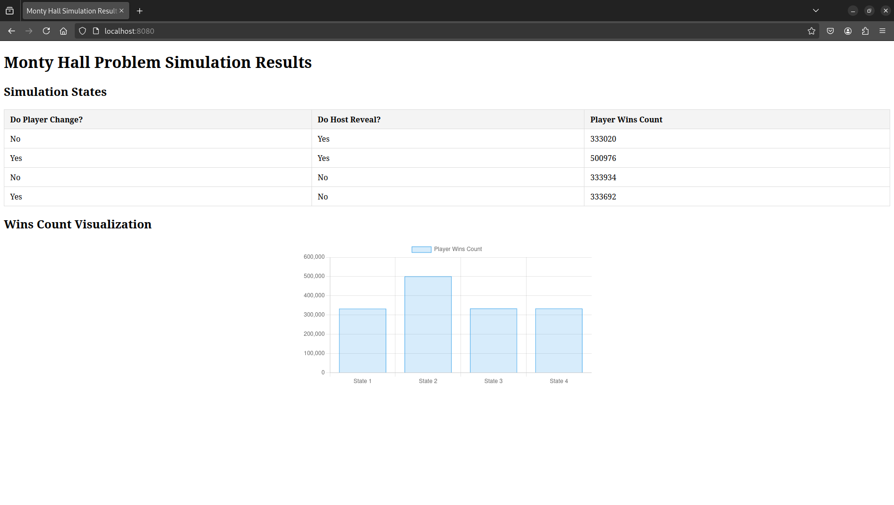

# monty-hall-problem-wasm



## Build

```
make prepare

make build
```

## Example

The file index.html demonstrates how to use this WASM module.

To view it in a browser, you need to use a server. The index.html file must be in the same folder as the "pkg" folder, which will be generated after building the project.

For example, you can use Node's "http-server" to serve the project. Run the following command from the root of the project:

```
http-server
```
